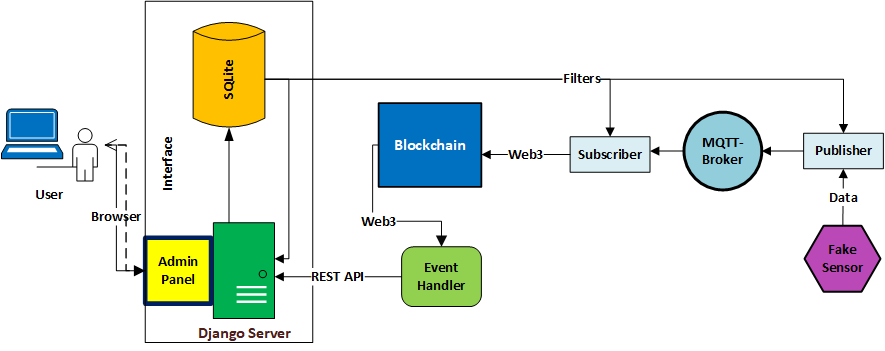

# IOT_Blockchain_Data_Integration

## Overview

The project simulates a reading from a fake sensor (data from the [UMass Smart Dataset*- 2017 release](https://traces.cs.umass.edu/index.php/Smart/Smart), including a wide variety of data collected from real homes) and stores the values on a local blockchain. The user can set filters in a panel to determine what data from this sensor is within the normal range and should be stored in the blockchain, as well as filters for the speed at which data can be read from the sensor or sent to the blockchain.
[Project details](docs-img%2Fsensor_data_integration.pdf)

## Architecture

  

## Prerequisites

- Install [Python3.11](https://www.python.org/downloads/)

- Install [Ganache](https://trufflesuite.com/ganache/)

- Install [Mosquitto Broker](https://mosquitto.org/download/)

### Set virtual environment

`py -3.11 -m venv venv`

`.\venv\Scripts\activate`

### Install Requirements

`pip3 install -r requirements.txt`

### Django Server

`cd django_website`

`python manage.py makemigrations core`

`python manage.py migrate`

#### Create superuser

`python manage.py createsuperuser`

    Username: admin
    Password: admin
    Password (again): admin
    Bypass password validation and create user anyway? [y/N]:y

## Run

### 1. run mosquitto broker service on port 1883

run the command prompt as an administrator and
navigate to your broker installation location

`net start mosquitto`

### 2. run Django server:

`cd django_website`

`python manage.py runserver`

 visit (http://localhost:8000/admin) to see server running

### 3. run subscriber.py 

### 4. run publisher.py